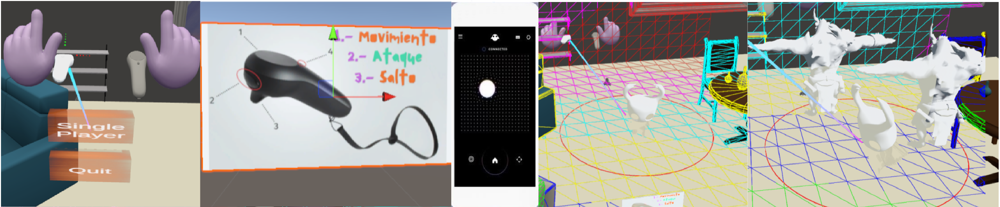

# My World - Magic Leap Project

## Introduction
This project, developed as a practical proposal for the Human-Computer Interaction course, focuses on an augmented reality (AR) survival game using the Magic Leap 1 device. Magic Leap combines real-world elements with virtual elements, allowing users to interact naturally and immersively. The goal is to create an entertaining, immersive experience that fully utilizes Magic Leap's mixed reality capabilities in both single-player and collaborative modes.

## Game Overview
My World is a survival game where the main character, controlled by the player, must fend off waves of enemies. The player uses the Magic Leap headset to visualize and control the character, who can perform predefined movements using the Magic Leap controller. The game features three rounds of increasing difficulty, where enemies spawn at the edge of the player's range. The game ends if the main character is hit by an enemy.

## Tools and Technologies
- **Unity 2020.2.2** and **SDK 0.25.0**: Main development environment.
- **Blender**: For 3D character modeling.
- **Mixamo**: For character animations.
- **Magic Leap Assets**: Utilized for camera access, environment mapping, and other mixed reality functionalities.
- Magic Leap Hub
- Magic Leap Unity Examples Project
- A Magic Leap 1 device that has Developer Mode enabled
  

## Setup and Usage
To set up and run the project:
1. **Download the [Magic Leap Unity Project Template](https://ml1-developer.magicleap.com/en-us/learn/guides/get-started-developing-in-unity)**.
2. **Clone this repository from [GitHub](https://github.com/Josep152/my_world_magicleap)**.
3. **Copy the contents of this repository into the `Assets` folder of the downloaded Magic Leap Unity Project Template**.
4. Open the project in Unity 2020.2.2.
5. Ensure the Magic Leap SDK 0.25.0 is installed.
6. Follow the instructions in the `Setup.md` file for device integration and initial configuration.
7. Use the Magic Leap controller to navigate and interact within the game.

## Game Modes
### Single Player
The player controls the main character, Hollow Knight, in a mapped virtual environment overlaying the real world. The game features three rounds of increasing enemy difficulty, with actions including movement, attack, and defense using the Magic Leap controller.

### Collaborative Mode
Developed using WebRTC for real-time collaboration, the game allows a second player to view the gameplay on a PC. A secondary controller generates 3D objects to obstruct enemy paths, enhancing collaborative gameplay.

## WebRTC Setup
Developed using WebRTC for real-time collaboration, the game allows a second player to view the gameplay on a PC. 

### Requirements
To run this example, you’ll need Python 3

### Running the Example Scene
To run the WebRTC example, you need to set up two parts - the server on your computer, and the scene on your device. This section goes over both parts.
#### Set up the Server
1. Ensure both your computer and the Magic Leap device are connected to the same network.
2. Open a command-line interface (CLI).
3. Find and make note of your computer's local IP address by entering the following command:
   - Mac and Linux: `ifconfig`
   - Windows: `ipconfig`
4. Navigate to the Server directory inside the Magic Leap Examples project:
   ```sh
   cd <PATH-TO-YOUR-PROJECT-FOLDER>/Assets/MagicLeap/Examples/WebRTCSetup/Server
   ```
5. Start the server by running the following command:
    ```sh
   python server.py
   ```
6. Open http://127.0.0.1:8080/ in a browser window (not on the device).
7. On the website, select Connect and grant access to both the camera and microphone.

### Set up the Device and the Scene
1. Power on the Magic Leap and connect the device to your computer. Allow USB debugging if prompted.
2. Open the Unity Hub and then open the Magic Leap examples project.
3. Navigate to the Magic Leap examples folder: MagicLeap > tools > unity > version > MagicLeap_Examples.
4. Open MagicLeap_Examples as your project.
5. In Unity, go to File > Build Settings.
6. Under Scenes in Build, put a checkmark next to MagicLeap/Examples/Scenes/WebRTC.
7. Make sure your Magic Leap device is powered on and configured for developer mode.
8. Click Build and Run. If prompted, create a folder for Unity builds.
9. When the project builds, put on your Magic Leap 2 headset, accept the prompts, and start the WebRTC experience.
10. Enter the address of your server (e.g., 192.168.1.15X) and click Connect.
You should see the video streams from both your computer and the Magic Leap 2 headset.


## Additional Resources
To use a second controller for the collaborative mode, download the necessary applications from the following link:

[Download Second Controller Applications](https://drive.google.com/drive/folders/12whgEV0gQuzFfjroieBsw9aOhiJOjVdK)

## Challenges and Solutions
### Unity Compatibility
- Ensuring compatibility with Magic Leap required selecting the correct Unity version.
- Adaptations were made for efficient 3D model and texture handling to optimize performance on Magic Leap hardware.

### Real-time Environment Mapping
- Advanced algorithms were used for environment detection and mapping.
- Persistent and accurate integration of virtual objects with the real world was essential.

### Mixed Reality Interaction
- Natural and fluid interactions were prioritized, including gesture detection and controller use.
- High performance and low latency were critical to avoid motion sickness and ensure precise interactions.

## Future Work
- **Performance Optimization**: Further reduce latency and improve environment mapping.
- **Enhanced Multiplayer**: Implement full synchronization and data sharing for remote collaboration.
- **Extended Gameplay Features**: Introduce new enemy types, levels, and power-ups.

## Contribution Guidelines
We welcome contributions from the community. Please fork the repository and create a pull request with a detailed description of your changes. Ensure compatibility with the current project setup and adhere to the coding standards outlined in `CONTRIBUTING.md`.

## Visual Overview


For more details, refer to the complete project report and documentation in the repository.

## Contact
For any questions or further information, please reach out to the project maintainers via the GitHub repository.
